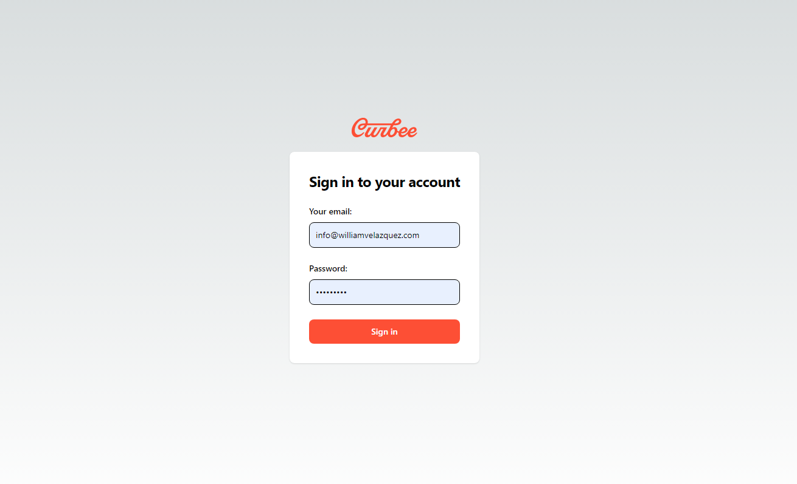
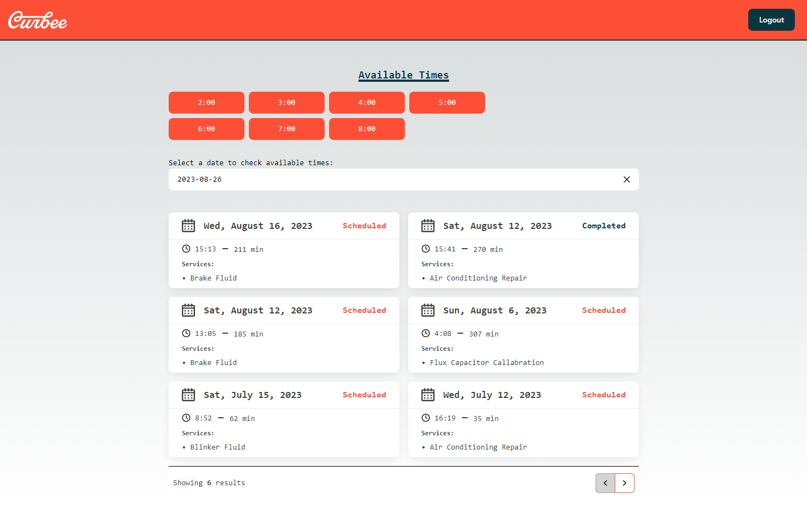
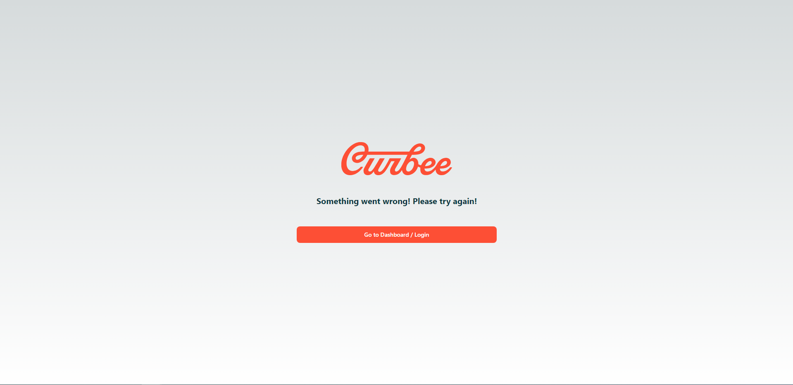
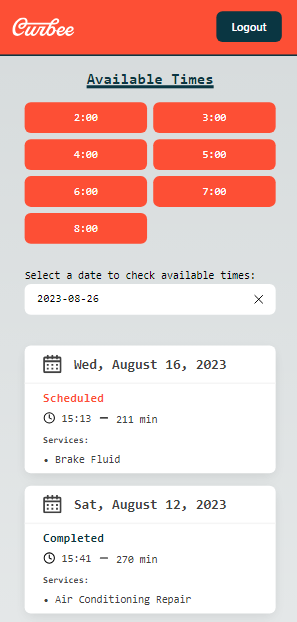
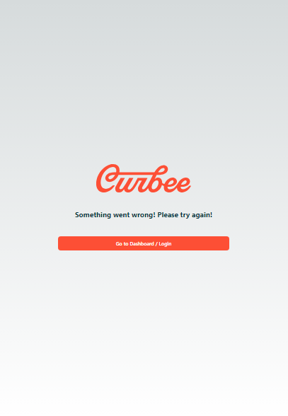
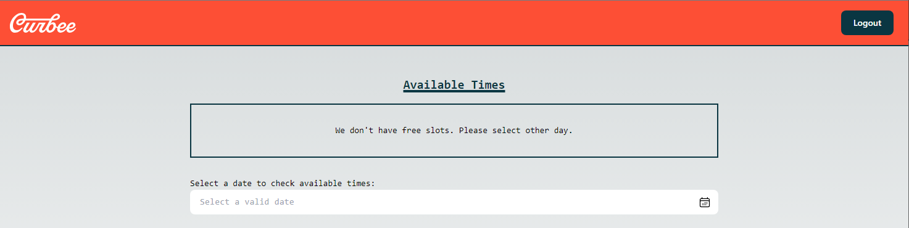

# Carbee - Appointments

List of appointments and availability times, developed with NextJs, ReactJs and using a custom API.


### 🛠️ Installation

Require Node.JS
```
npm install
```
>This is a [Next.js](https://nextjs.org/) project bootstrapped with [`create-next-app`](https://github.com/vercel/next.js/tree/canary/packages/create-next-app).


### 🖥 Execution

📌**Development Environment**
```
npm run dev
```

Open [http://localhost:3000](http://localhost:3000) with your browser to see the result.
>This project runs on **http://localhost:3000**


### 💻 Technologies

  * Next Js
  * React Js
  * TypeScript
  * Tailwind
  * JavaScript

### ✒️ Author

* **William Velazquez** - [Website](https://williamvelazquez.com/)

If you want to know about the insights [click here!](https://github.com/WilliamVelazquez/carbee-appointments/pulse/monthly)


### 📷 Screenshots









## 📦Deploy on Vercel

The easiest way to deploy your Next.js app is to use the [Vercel Platform](https://vercel.com/new?utm_medium=default-template&filter=next.js&utm_source=create-next-app&utm_campaign=create-next-app-readme) from the creators of Next.js.

Check out our [Next.js deployment documentation](https://nextjs.org/docs/deployment) for more details.

## 📄License

This project is licensed under the terms of the **MIT license**.


### 🎁 Contribute

Feel free to contribute to the project!

📌**Project Reflections**

You can find project reflections [here](./QUESTIONS.md).
